# Base code for 16 sensors compatible with Raspberry Pi

A simple python project for testing all the 16 sensors in order to see if they work well.  
It all starts with a menu for choosing the sensor group that we want to test, it also demands in which channel did we connect the data pin, and then the code will output the sensor data for 1min whenever there is an event trigger by the sensor. The output is simple text to the terminal.  
For this first commit only the sensors with simple digital output are covered.

### Index
* [The 16 sensors covered / to cover](#16_sensor)
* [Basic notions](#basic_notions)
* [Code explanation](#code)
* [Sensors table](#the_table)
* [Sensors one by one](#one_by_one)
* [Changelog](#changelog)

##  16 sensors covered

1. DHT11 temperature and humidity sensor module
2. HC-SR501 infrared human body induction module
3. ~~DS1302 real time clock module~~
4. Rain sensor module
5. Sound sensor module
6. HC-SR04 ultrasonic sensor module
7. Flame sensor module
8. ~~KY-008 laser head sensor module~~
9. Photosensitive resistance sensor module
10. VY-69 soil moisture sensor module
11. Obstacle avoidance module
12. Vibration sensor module
13. MQ-2 gas sensor module
14. ~~433M super regenerative module~~
15. Tilt sensor module
16. Path tracing module

##  Basic notions

### GPIO

**G**eneral **P**urpose **I**nput **O**utput 

### BCM or BOARD  
**BCM -**  "Broadcom SOC channel" number, it will be different in some raspberry Pi versions.  
**BOARD -** The numbers printed on the board.

### Polling vs Interrupts (Edge detection)
**Polling** is the way of checking the input in a certain time, but it can miss an input if the program reads the value at the wrong time and consumes a lot of CPU.

**Interrups** occurs when there is a change in state of the input. 

More info [here.](https://sourceforge.net/p/raspberry-gpio-python/wiki/Inputs/)

### Output
1/High/3.3V or 0/LOW/0V 

### Analog vs Digital
The digital input only returns 0 or 1, but the analog can returns a bigger interval of values, being perfect for example for the sound sensor where is possible to detect the intensity of the sound.

More info [here.](https://www.futurelearn.com/courses/physical-computing-raspberry-pi-python/0/steps/23044)

##  Code explanation

The program is organised in 2 files, `main.py` and `sensor_test.py`, the first one runs the menu and calls the second one. The file `sensor_test.py` is where the code receives the data from the sensor.

To add the interrups in order to fire when there is an event:

~~~
GPIO.add_event_detect(channel, GPIO.BOTH, bouncetime=300)
GPIO.add_event_callback(channel, callback)
~~~

And when we finish using the GPIO pins, we remove the event detection and we make a cleanup to the GPIO pins.

~~~
GPIO.remove_event_detect(channel)
GPIO.cleanup()
~~~

### Adafruit library
First it’s necessary to have the `build-essential` and `python-dev` packages installed:

~~~~
sudo apt-get update
sudo apt-get install build-essential python-dev
~~~~

Second, we can clone the Adafruit library from the library repository:

~~~~
git clone https://github.com/adafruit/Adafruit_Python_DHT.git
cd Adafruit_Python_DHT
~~~~

And finally install the library in our system for python 2 and 3:

~~~~
sudo python setup.py install
sudo python3 setup.py install
~~~~

At this point the library will be installed and ready to be used.

##  Sensors table

| # | Sensor | Voltage | Extra | Analog Port | Digital Output |
|--:|--------|:-------:|:-----:|:-----------:|:------:|
| 1 | DHT11 temperature and humidity sensor module | 3.3V -5V | | No | Lib needed |
| 2 | HC-SR501 infrared human body induction module | 3.3V -5V |  | No |  0 / 1 |
| 3 | DS1302 real time clock module | 3.3V |  | Yes | Different |
| 4 | Rain sensor module | 3.3V -5V |  | Yes | 0 / 1 |
| 5 | Sound sensor module | 5V |  | Yes | 0 / 1 |
| 6 | HC-SR04 ultrasonic sensor module | 5V | Echo (reduce power) | No |  0 / 1 |
| 7 | Flame sensor module | 3.3V -5V |  | No | 0 / 1 |
| 8 | KY-008 laser head sensor module | 5V | need laser receiver | No | 0 / 1 time |
| 9 | Photosensitive resistance sensor module | 3.3V -5V |  | No | 0 / 1 |
| 10 | VY-69 soil moisture sensor module | 3.3V -5V |  | Yes | 0 / 1 |
| 11 | Obstacle avoidance module | 3.3V -5V |  | No | 0 / 1 |
| 12 | Vibration sensor module | 3.3V -5V |  | No | 0 / 1 |
| 13 | MQ-2 gas sensor module | 5V |  | Yes | 0 / 1 |
| 14 | 433M super regenerative module | 5V | 2 Data pins | No | Lib needed (Rpi) |
| 15 | Tilt sensor module | 3.3V -5V |  | No | 0 / 1 |
| 16 | Path tracing module | 5V |  | No | 0 / 1 |

##  Sensors one by one

+ The sensor 1 needs a special library in order to obtain the data.
+ The sensors 2,4,5,6,7,9,10,11,12,13,15 and 16 they all have the same pattern, the output is either 1 or 0. 
+ The sensor 3 it’s a clock for store the time.
+ The sensor 8 we can only turn it on or off, in order to make it more interesting is necessary a laser receiver, to know if an object has crossed the laser path.
+ And finally the sensor 14, like the sensor 1 needs a special library in order to get the sensor data.

### Sensor 1 - Temperature and humidity module

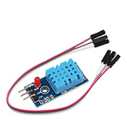

##### How it works
There are 2 DHT11, one with 3 pins and the other with 4 pins, the last one will require a resistor (10K) to be place between the pin 1 (3.3V) and the pin 2 (Data). 
The three pin DHT11 has already the resistor.

This sensor requires a specific protocol to be applied to the data pin, we can easily achieve that with the Adafruit DHT library.

It will return the temperature and humidity in ºC and %.

### Sensor 2 - Infrared module

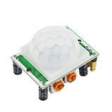

##### How it works
The Infrared sensor or PIR sensor can detect motion in a range from 3m to 7m and it's possible to adjust the delay time from 5s to 200s.

### Sensor 3 - Time clock module

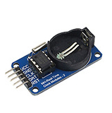

##### How it works

### Sensor 4 - Rain module

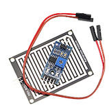

##### How it works
The rain sensor will output low level when it detects rain in the board. It's possible to calibrate the sensor potentiometer in order to trigger only when is has couple of drops or a really large one.

### Sensor 5 - Sound module

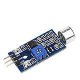

##### How it works
The sound sensor will output low level when a sound is detected.
Important note: Some modules are complitly off tuned, it's necessary to adjust the potentiometer, conter clockwise will reduce the sensitivity, the equilibrium point is when 1 of the 2 leds turns off.

### Sensor 6 - Ultrasonic module

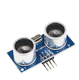

##### How it works
**Important:** The sensor output signal (ECHO) is rated 5V, but the input pin on the Raspberry Pi GPIO is rated 3.3V. Sending a 5V signal to the GPIO could damage it. It's necessary to use a small voltage divider circuit, consisting of two resistors, to lower the sensor output voltage to something that the Raspberry Pi can handle.

### Sensor 7 - Flame module

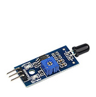

##### How it works
This sensor detects a flame or a light source, with a wavelengh from 700nm to 1000nm, the sensitive can be ajustable.

### Sensor 8 - Laser head module

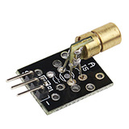

##### How it works

### Sensor 9 - Photosensitive resistance module

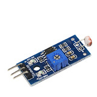

##### How it works
This sensor can detect the ambient brightness and light intensity.

### Sensor 10 - VY-69 soil moisture module

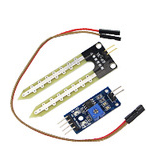

##### How it works

### Sensor 11 - Obstacle avoidance module

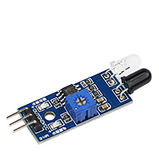

#####How it works

### Sensor 12 - Vibration module

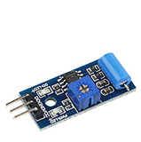

##### How it works

### Sensor 13 - MQ-2 Gaz module

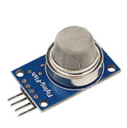

##### How it works

### Sensor 14 - 433MHz regenerative module

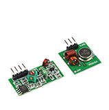

##### How it works

### Sensor 15 - Tilt module

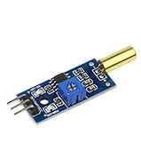

##### How it works

### Sensor 16 - Path tracing module

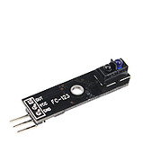

##### How it works
The infrared transmitter on the sensor emits rays, if it touch a black surface it will absorbed and the sensor will output high level (1), else, it will output low level (0).

##  Credits and changelog
**Version 1.0 - 12/06/2018** 
  
* Base code for the first sensors

Ivo Lopes aka Charro 2018
